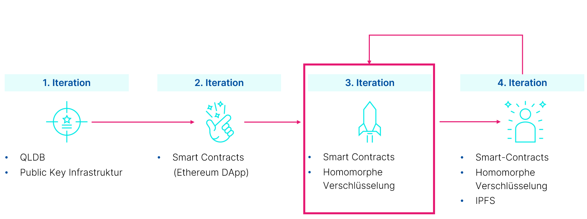

# Benchmarking Distributed Ledger Monorepo
This monorepo holds all the code/submodules for the different iterations, described in the corresponding paper.

## Iterations

## Documentation
Please refer to the wiki at [https://github.com/the-future-of-benchmarking/proof-of-concept/wiki](https://github.com/the-future-of-benchmarking/proof-of-concept/wiki)
